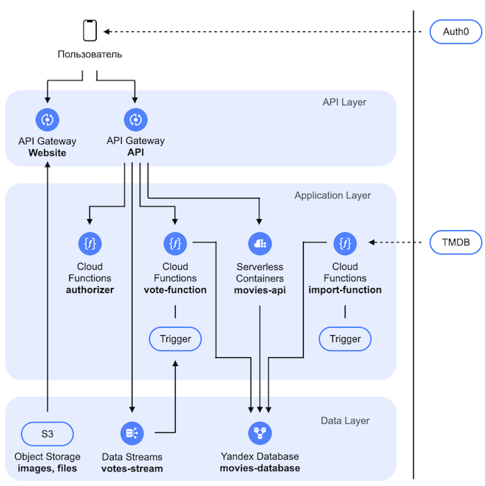

# Workshop: Developing a serverless application in Yandex Cloud

## Description

As part of the hands-on project, you will go through the entire process of developing a serverless application from scratch using the state-of-the-art tools and services. You will build a small yet functional movie service using TypeScript and Node.js, and then deploy it in Yandex Cloud.

Throughout the entire project, you will not come across such terms as virtual machine or server. Not even once!

## Tools

Before getting started with the hands-on project, install and configure the following tools:

- WebStorm (or any alternative development environment supporting TypeScript)
- Git
- Typescript
- Node.js
- Docker
- Yandex Cloud CLI(yc)
- Terraform
- Amazon Web Services(AWS) CLI

You can find a step-by-step guide [here](ENVIRONMENT.md).

## App architecture



## Workshop contents

1. [Getting started](#begin)
2. [Creating a database](#database)
3. [Running CRUD operations](#crud)
4. [Developing the REST API](#rest)
5. [Importing movies and images](#import)
6. [Authentication and authorization](#authorization)
7. [Rating](#ratings)
8. [Web interface](#website)

<div id="begin"/>

### Getting started

1. Download the project from the Git repository and open it in WebStorm:

```bash
git clone <link_to_repository>
```

2. Run this command:

```bash
yc config profile get <profile_name>
```

3. Copy the cloud, folder, and OAuth token IDs from the output and paste them into the appropriate fields in the [provider.tf](deploy/provider.tf) file. Export the folder ID to the environment variable:

```bash
export FOLDER_ID=<folder_ID>
echo $FOLDER_ID
```

4. In the terminal, run the Terraform initialization command in the `deploy` directory:

```bash
cd deploy
terraform init
``` 

Run all subsequent `terraform` commands under the `deploy` directory.

<div id="database"/>

### Creating a database

There are two ways to design and develop web applications: top-down or bottom-up. While this is a disputable topic, we will opt for the latter approach. This means our first step is to come up with a data schema or model, select a DBMS, and then create an app database and the relevant tables to match our schema.

Yandex Cloud serverless stack includes Yandex Database featuring a dedicated serverless mode. This is what we will be using for our project.

Our web app will need two tables: `movies` to keep movies and `votes` to keep user ratings. Each entry in the `movies` table will contain a unique movie ID and fixed attributes. The `votes` table will follow the same pattern.

Since we know what kind of schema and DBMS to use, we can now create a database:

1. The [ydb.tf](deploy/ydb.tf) file contains configuration for the YDB database to store movie data. To deploy it in Yandex Cloud, run this command:

```bash
terraform apply -target=yandex_ydb_database_serverless.movies_database
```

After successfully running it, you will get `movies-database` in your folder. In the console, the `movies_database_document_api_endpoint` variable will hold the DB endpoint, while `movies_database_path`, its relative path.

Export both values to the environment variables:

```bash
export DOCUMENT_API_ENDPOINT=<movies_database_document_api_endpoint>
echo $DOCUMENT_API_ENDPOINT
export MOVIES_DATABASE_PATH=<movies_database_path>
echo $MOVIES_DATABASE_PATH
```

2. To create tables, run these commands:

```bash
aws dynamodb create-table \
    --table-name movies \
    --attribute-definitions \
      AttributeName=id,AttributeType=N \
      AttributeName=title,AttributeType=S \
      AttributeName=type,AttributeType=S \
      AttributeName=original_title,AttributeType=S \
      AttributeName=original_language,AttributeType=S \
      AttributeName=release_date,AttributeType=S \
      AttributeName=poster_path,AttributeType=S \
      AttributeName=popularity,AttributeType=N \
      AttributeName=video,AttributeType=S \
      AttributeName=vote_count,AttributeType=N \
      AttributeName=vote_average,AttributeType=N \
      AttributeName=genres,AttributeType=S \
      AttributeName=backdrop_path,AttributeType=S \
      AttributeName=adult,AttributeType=S \
      AttributeName=overview,AttributeType=S \
    --key-schema \
      AttributeName=id,KeyType=HASH \
    --global-secondary-indexes \
        "[
            {
                \"IndexName\": \"PopularityIndex\",
                \"KeySchema\": [{\"AttributeName\":\"type\",\"KeyType\":\"HASH\"}, {\"AttributeName\":\"popularity\",\"KeyType\":\"RANGE\"}],
                \"Projection\":{
                    \"ProjectionType\":\"ALL\"
                }                
            }
        ]" \
    --endpoint ${DOCUMENT_API_ENDPOINT}

aws dynamodb create-table \
    --table-name votes \
    --attribute-definitions \
      AttributeName=id,AttributeType=S \
      AttributeName=user_id,AttributeType=S \
      AttributeName=movie_id,AttributeType=N \
      AttributeName=value,AttributeType=N \
    --key-schema \
      AttributeName=id,KeyType=HASH \
    --global-secondary-indexes \
        "[
            {
                \"IndexName\": \"MovieIndex\",
                \"KeySchema\": [{\"AttributeName\":\"movie_id\",\"KeyType\":\"HASH\"}],
                \"Projection\":{
                    \"ProjectionType\":\"ALL\"
                }                
            }
        ]" \
    --endpoint ${DOCUMENT_API_ENDPOINT}
```

To verify that the tables have been created, run the `describe-table` command as shown below:

```bash
aws dynamodb describe-table --table-name movies --endpoint ${DOCUMENT_API_ENDPOINT}
aws dynamodb describe-table --table-name votes --endpoint ${DOCUMENT_API_ENDPOINT}
```

The `movies` table requires two indexes: one for quickly searching a movie by its ID and the other, for sorting movies by popularity. Similarly, the `votes` table will have two indexes: one to find a specific user’s rating for a particular movie and the other, to retrieve all ratings for a movie.

<div id="crud"/>

### Running CRUD operations

Almost every app or service has its own data or database layer. We will use this layer each time we need to create, read, update, or delete movies and ratings. These actions are collectively called CRUD operations.

For simplicity, to access our database, we will be using the AWS DynamoDB Document API, specifically, the [AWS SDK for JavaScript v3](https://docs.aws.amazon.com/AWSJavaScriptSDK/v3/latest/index.html) library it is implemented through.

The [model.ts](src/model.ts) file defines the `Movie` and `Vote` models via the TypeScript interface, while [repository.ts](src/repository.ts) implements primary CRUD operations for using these entities.

Keep in mind that you will need IAM tokens when getting authorized to perform these operations. The IAM tokens will be issued for the service account we will create later.

To get an IAM token before the operation, the [metadata service](https://yandex.cloud/docs/serverless-containers/operations/sa) is called.

In this section, you will install the required dependencies and compile the JavaScript code.

1. To install the dependencies, run this command from the project root:

```bash
npm ci
```

After running it, you will get the `node_modules` directory with all required dependencies.

2. Run the project build:

```bash
npm run build
```

After running it, the project will include the `dist` directory with the compiled JS files.

<div id="rest"/>

### Developing REST API

REST API is a fundamental component of nearly every modern web service, as most apps still use the REST approach to implement their APIs. When developing the API, it is crucial to consider the use cases of your app and the client platforms (web, mobile, TV, etc.) they will run on.

For our project, we will build a basic web UI with a page listing movies and a page showing detailed information about each movie.

The [openapi/api.yaml](openapi/api.yaml) file already contains the ready-to-go OpenAPI specification for the REST API. Note that it outlines the primary operations for managing movies and ratings.

To implement the service according to the specification, we will use the [OpenAPI Backend](https://github.com/anttiviljami/openapi-backend) library in combination with the [Express](https://expressjs.com) framework.

The [app.ts](src/app.ts) file initializes the required classes, maps operations, and starts the HTTP service.

The app will be built as a Docker image and deployed in [Serverless Containers](https://yandex.cloud/services/serverless-containers).

Follow these steps to deploy the REST API:

1. To get started, create a service account named `movies-api-sa` for the application. It is described in the [sa.tf](deploy/sa.tf) file. To do this, run the following command in the console:

```bash
terraform apply -target=yandex_iam_service_account.movies_api_sa
```

In the command output, the `movies_api_sa_id` variable contains the ID of the created service account. Add it to the environment variable:

```bash
export MOVIES_API_SA_ID=<movies_api_sa_id>
echo $MOVIES_API_SA_ID
```

The app will use the service account to do the following:

* Invoke a container in [Serverless Containers](https://yandex.cloud/services/serverless-containers).
* Run DB operations in [Yandex Database](https://yandex.cloud/services/ydb).
* Call a function in [Cloud Functions](https://yandex.cloud/services/functions).
* Work with [Object Storage](https://yandex.cloud/services/storage).
* Write data to a stream in [Yandex DataStreams](https://yandex.cloud/services/data-streams).

To perform these actions, assign the required roles to this service account (for simplicity, assign them for the entire folder rather than an individual resource). To do this, run the following commands one by one:

```bash
yc resource-manager folder add-access-binding ${FOLDER_ID} --role ydb.admin --subject serviceAccount:${MOVIES_API_SA_ID}
yc resource-manager folder add-access-binding ${FOLDER_ID} --role container-registry.images.puller --subject serviceAccount:${MOVIES_API_SA_ID}
yc resource-manager folder add-access-binding ${FOLDER_ID} --role serverless.containers.invoker --subject serviceAccount:${MOVIES_API_SA_ID}
yc resource-manager folder add-access-binding ${FOLDER_ID} --role serverless.functions.invoker --subject serviceAccount:${MOVIES_API_SA_ID}
yc resource-manager folder add-access-binding ${FOLDER_ID} --role storage.editor --subject serviceAccount:${MOVIES_API_SA_ID}
yc resource-manager folder add-access-binding ${FOLDER_ID} --role yds.admin --subject serviceAccount:${MOVIES_API_SA_ID}
```

Enter the ID of the service account you created earlier in the beginning of the [openapi/api.yaml](openapi/api.yaml) specification, namely, into the `x-yc-apigateway.service_account_id` field.

2. Next, create a registry and a repository for Docker images in [Container Registry](https://yandex.cloud/services/container-registry) to host the application image. The required resources are outlined in the [container-registry.tf](deploy/container-registry.tf) file. To complete this step, run these commands:

```bash
terraform apply -target=yandex_container_registry.default
terraform apply -target=yandex_container_repository.movies_api_repository
```

The `movies_api_repository_name` variable in the command output will show the repository name you will use later to upload the image. Export it to the environment variable:

```bash
export MOVIES_API_REPOSITORY_NAME=<movies_api_repository_name>
echo $MOVIES_API_REPOSITORY_NAME
```

Next, configure Docker to work with the newly created repository using this command:

```bash
yc container registry configure-docker
```

3. Build the app Docker image (the Docker image configuration file is usually called [Dockerfile](Dockerfile)) and push it to the repository created in the previous step. To do this, run these commands one by one from the project root:

```bash
docker build -t ${MOVIES_API_REPOSITORY_NAME}:0.0.1 .
docker push ${MOVIES_API_REPOSITORY_NAME}:0.0.1
```

4. Create a serverless container to run from the image you created earlier:

```bash
yc sls container create --name movies-api-container --folder-id ${FOLDER_ID}
```

The command output will show the new container ID. Export it to the environment variable:

```bash
export MOVIES_API_CONTAINER_ID=<container_ID>
echo $MOVIES_API_CONTAINER_ID
```

Deploy the container revision with image `0.0.1`:

```bash
yc sls container revisions deploy \
	--folder-id ${FOLDER_ID} \
	--container-id ${MOVIES_API_CONTAINER_ID} \
	--memory 512M \
	--cores 1 \
	--execution-timeout 5s \
	--concurrency 4 \
	--environment AWS_ACCESS_KEY_ID=FAKE_AWS_ACCESS_KEY_ID,AWS_SECRET_ACCESS_KEY=FAKE_AWS_SECRET_ACCESS_KEY,DOCUMENT_API_ENDPOINT=${DOCUMENT_API_ENDPOINT} \
	--service-account-id ${MOVIES_API_SA_ID} \
	--image ${MOVIES_API_REPOSITORY_NAME}:0.0.1
```

Note that we have configured the `concurrency` parameter to allow a single running instance of the serverless container to process multiple concurrent requests. Also note that we are injecting the database endpoint into our app through the `DOCUMENT_API_ENDPOINT` environment variable.

5. To get the service running and accessible from the web, you need to deploy [API Gateway](https://yandex.cloud/services/api-gateway). In the [openapi.yaml](openapi/api.yaml) specification, replace `${MOVIES_API_CONTAINER_ID}` with the ID of the created container in all integrations.

The [api-gateway.tf](deploy/api-gateway.tf) file contains the API gateway configuration based on the specification. To create it in the cloud, run the following command:

```bash
terraform apply -target=yandex_api_gateway.movies_api_gateway
```

In the command output, the `movies_api_gateway_domain` variable contains the name of the domain used to deploy the new API gateway. Export it to the environment variable:

```bash
export MOVIES_API_GATEWAY_DOMAIN=<movies_api_gateway_domain>
echo $MOVIES_API_GATEWAY_DOMAIN
```

6. Let's run a health check for the service you deployed. To do this, send an HTTP request using the `curl` command:

```bash
curl "${MOVIES_API_GATEWAY_DOMAIN}/movies?limit=10"
```

The response must return an empty list (`[]`) since there are no entries in the database yet. You can also upload the specification to [Postman](https://www.postman.com) or [SwaggerHub](https://swagger.io/tools/swaggerhub/) by adding the address of the created API gateway from the `${MOVIES_API_GATEWAY_DOMAIN}` variable to the `servers` section. This will enable you to easily make REST API calls.

In the web console, navigate to the serverless container page and under **Logs**, you will find a message related to the call.

You can also go to the **Monitoring** section to view the call on the charts. Similarly, on the API gateway page, you can view the logs and call charts in their respective sections.

<div id="import"/>

### Importing movies and images

The essense of any website or web application is its content. In our case, that content is movie-related data. In this section, we will teach our app to import data from external sources.

As you may know, even powerful movie websites once started out as simple [IMDB](https://www.imdb.com) parsers. For our app, we will use data from open-source [TMDB](https://www.themoviedb.org). To do this, we will create an import function and configure a trigger for scheduled runs.

To simplify the process for you, we have already registered with TMDB, got an API key, and uploaded the [tmdb.json](https://storage.yandexcloud.net/movies-app/tmdb.json) file with the required data to Object Storage.

Let’s assume this file is updated on a regular basis. Our app just needs to fetch it regularly to read and update the movie data in the database. The proper function for this is already coded in the [import.ts](src/import.ts) file. Along with updating `movies-database`, it downloads posters and backdrops and places them to a separate Object Storage bucket. The app web UI will display these images for each movie by pulling them from that bucket.

1. Create a bucket in Object Storage. The required configuration is described in the [object-storage.tf](deploy/object-storage.tf) file. To apply this configuration, run the following command:

```
terraform apply -target=yandex_storage_bucket.movies_images_bucket
```

The command output will contain the bucket name in the `movies_images_bucket` variable. Save it to the environment variable:

```bash
export MOVIES_IMAGES_BUCKET=<movies_images_bucket>
echo $MOVIES_IMAGES_BUCKET
```

2. Now deploy the import function. The configuration you need is already in the [import-function.tf](deploy/import-function.tf) file. The function will run on the `nodejs16-preview` Node.js runtime with significantly reduced cold start times.

Pay attention to the environment variables in the `environment` parameter, specifically `IMAGES_BUCKET_NAME`, which is the name of the previously created bucket the function will upload images to.
   
Bundle and zip the function code, and then deploy it by running the following commands from the project root:

```bash
npm run package-import && cd deploy
terraform apply -target=yandex_function.import_function
```

3. Now, configure a trigger that will run the import function on a schedule. The trigger, just like the function, is already configured in the [import-function.tf](deploy/import-function.tf) file.

Pay attention to the cron expression in the `cron_expression` parameter, which schedules the function to run every hour.

To create and start the trigger, simply run the following command:   

```bash
terraform apply -target=yandex_function_trigger.import_trigger
```

4. Run the function and wait for it to complete, and then send another request to the REST API:

```bash
yc sls function invoke --name import-function
# {"statusCode":200,"body":"Imported 100 movies from TMDB","isBase64Encoded":false}
curl "${MOVIES_API_GATEWAY_DOMAIN}/movies?limit=10"
```

The response will show you an array of JSON objects for the movies that were added to the database.

<div id="authorization"/>

### Authentication and authorization

To implement authentication and authorization in our app, we will use [Auth0](https://auth0.com) and the option to integrate a custom [authorizer function](https://yandex.cloud/docs/api-gateway/concepts/extensions/function-authorizer) with API Gateway.

We have already created and configured the required resources in Auth0 and written the [authorizer code](src/authorizer.ts). The authorizer retrieves the JWT from the `Authorization` header, verifies and decodes it, and checks if the user has the required roles and permissions to perform the operation.
 
The only thing left to do is deploy the authorizer and integrate it with the API gateway. The OpenAPI specification already describes the security schema we need. We will enhance it with a special extension to enable the API gateway to call the authorization function.

1. You can find the authorizer configuration in the [deploy/authorizer.tf](deploy/authorizer.tf) file. Create a ZIP archive of the function and apply the configuration by running the following commands:

```bash
npm run package-authorizer && cd deploy
terraform apply -target=yandex_function.authorizer
```

The command output will contain the authorizer function ID in the `authorizer_function_id` variable.

2. Uncomment the `securitySchemes.httpBearerAuth.x-yc-apigateway-authorizer` extension at the end of the API gateway [specification](openapi/api.yaml).

Copy the `authorizer_function_id` authorizer ID from the previous step and paste it to replace the `${AUTHORIZER_FUNCTION_ID}` variable in the `securitySchemes.httpBearerAuth.x-yc-apigateway-authorizer.function_id` field.
   
Additionally, uncomment the security section in every operation of the specification where it appears:
   
```yaml
      security:
        - httpBearerAuth: [ ]
```
3. Update the API gateway specification:

```bash
terraform apply -target yandex_api_gateway.movies_api_gateway
```

Now, if you make an HTTP call to the service using`curl "${MOVIES_API_GATEWAY_DOMAIN}/movies?limit=10"`, you will get the `{"message":"Unauthorized"}` response with the HTTP 401 status code.

<div id="ratings"/>

### Rating

Let's add a feature to rate movies and calculate those ratings. Our initial rating values will be sourced from TMDB.

We already have the function for importing and saving this data to the database. When a user rates a movie through the web interface, the API gateway will receive a `postVote` request with the new rating. After successful authorization, the gateway will log the rating to the stream in [Yandex DataStreams](https://yandex.cloud/services/data-streams) using a dedicated integration.

Each message from the stream will trigger a special function saving the user rating to the `votes` table and updating the movie rating in the database. The web interface will get the user rating via the `getVote` operation that has already been added to the REST API.

1. Create a new stream with two shards:

```bash
aws kinesis create-stream \
  --endpoint https://yds.serverless.yandexcloud.net \
  --stream-name ${MOVIES_DATABASE_PATH}/votes-stream \
  --shard-count 2
```

2. The rating and calculating function is implemented in the [src/vote.ts](src/vote.ts) file. Create a ZIP archive with the function and use the Terraform configuration in [deploy/vote-function.tf](deploy/vote-function.tf) to deploy it:

```bash
npm run package-vote && cd deploy
terraform apply -target yandex_function.vote_function
```

The command output will contain the new function ID in the `vote_function_id` variable. Save it to the environment variable:

```bash
export VOTE_FUNCTION_ID=<vote_function_id>
echo $VOTE_FUNCTION_ID
```

3. Create a trigger that will listen to the stream and invoke the voting function. To do this, run this command:

```bash
yc sls trigger create yds \
	--name vote-trigger \
	--database ${MOVIES_DATABASE_PATH} \
	--stream votes-stream \
	--stream-service-account-id ${MOVIES_API_SA_ID} \
	--batch-size 1024b \
	--invoke-function-id ${VOTE_FUNCTION_ID} \
	--invoke-function-service-account-id ${MOVIES_API_SA_ID} \
	--retry-attempts 3 \
	--retry-interval 10s
```

4. The specification features the `postVote` operation for submitting ratings, integrated specifically with DataStreams.

Insert the value of the `${MOVIES_DATABASE_PATH}` variable into the `stream_name` attribute of the `x-yc-apigateway-integration` extension for this operation. Then, update the API gateway:

```bash
terraform apply -target=yandex_api_gateway.movies_api_gateway
```

Note that the user ID from the HTTP request path is used as the partitioning key. This ensures that user ratings are updated in the system in the order they were submitted.

<div id="website"/>

### Web UI

The app web UI is a single-page application (SPA) located in the [web](web) directory of the project. Let's upload the entire [web](web) directory to a separate bucket and deploy another API gateway over it:

1. Create a bucket for storing the website:

```bash
terraform apply -target=yandex_storage_bucket.movies_website_bucket
```

The command output will contain the new bucket name in the `movies_website_bucket` variable. Export it to the environment variable:

```bash
export MOVIES_WEBSITE_BUCKET=<movies_website_bucket>
echo $MOVIES_WEBSITE_BUCKET
```

2. The [openapi/website.yaml](openapi/website.yaml) file contains the API gateway specification for the website. Replace the `${movies_website_bucket}`, `${movies_images_bucket}`, and `${movies_api_sa_id}` variables with their respective values copied from the command output at the previous step.
   
Create an API gateway with the [deploy/website-gateway.tf](deploy/website-gateway.tf) configuration by running this command:

```bash
terraform apply -target=yandex_api_gateway.movies_website_gateway
```

The command output will contain the API gateway address in the `movies_website_gateway_domain` variable. Export it to the environment variable:

```bash
export MOVIES_WEBSITE_GATEWAY_DOMAIN=<movies_website_gateway_domain>
echo $MOVIES_WEBSITE_GATEWAY_DOMAIN
```

3. Fill out the website configuration parameters in the [web/assets/config.yaml](web/assets/config.yaml) file, replacing the `${movies_website_gateway_domain}` and `${movies_api_gateway_domain}` variables with the respective values copied from the command output at the previous step.

4. Upload the website files to the bucket:

```bash
aws --endpoint-url=https://storage.yandexcloud.net s3 cp --recursive web/ s3://${MOVIES_WEBSITE_BUCKET}
```

5. Test the application. To do this, access the website at `echo $MOVIES_WEBSITE_GATEWAY_DOMAIN`.
   Sign up and log in to the app. Once you see the list of movies, navigate to a movie page and try to submit a rating.

Click back to return to the movie page without refreshing it. Check that the movie rating has been updated and your own rating is shown correctly.

In the web console, you can view the logs and charts for the API gateways, serverless container, and data stream to make sure the web interface is communicating with your service.
   
   
